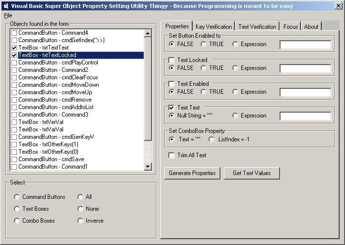



## Code Generator for Forms

### Description

This automates a bit of code in Visual Basic with verification of textboxes, allowing/suppressing keys in textboxes, and other features.

This is best implemented as a VB Add-in, but as I don't know how to yet, this will do for now.
 
### More Info
 

             |
---                |---
**Submitted On**   |2004-01-30 14:33:32
**By**             |[David Santos](https://github.com/Planet-Source-Code/PSCIndex/blob/master/ByAuthor/david-santos.md)
**Level**          |Intermediate
**User Rating**    |4.7 (14 globes from 3 users)
**Compatibility**  |VB 5\.0, VB 6\.0
**Category**       |[VB function enhancement](https://github.com/Planet-Source-Code/PSCIndex/blob/master/ByCategory/vb-function-enhancement__1-25.md)
**World**          |[Visual Basic](https://github.com/Planet-Source-Code/PSCIndex/blob/master/ByWorld/visual-basic.md)
**Archive File**   |[Code\_Gener1906186272005\.zip](https://github.com/Planet-Source-Code/david-santos-code-generator-for-forms__1-61369/archive/master.zip)

